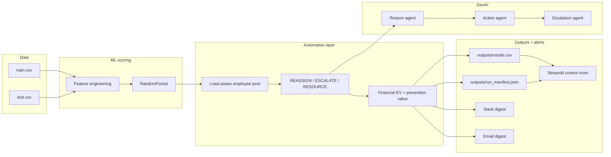

# Hackerthorn — SLA breach & cost-leakage prevention system

Hackerthorn is an **action-first AI system** for enterprise operations: it scores live task-level signals for SLA breach risk, **quantifies financial exposure**, and **initiates corrective automation** (reassignment, resource shifts, escalation) *before* penalties materialize. A **multi-agent GenAI layer** explains *why* a task is risky, *what* to do, and *how far* to escalate—so leaders see defensible narratives next to numbers.

This goes **beyond dashboards**: the pipeline is designed to be run on a schedule (cron, Airflow, GitHub Actions, Azure Logic Apps, etc.) so every refresh of the Streamlit control room reflects a fresh scoring and automation pass.

---

## What problem this solves

- **Reactive BI** shows red metrics after the damage is done.
- **Hackerthorn** continuously (or on a cadence you choose) ingests operational tasks, predicts breach probability, routes work away from overload, escalates early when capacity is gone, and attaches **expected penalty-weighted exposure** using contractual `penalty_cost` fields.
- **Multi-agent GenAI** provides audit-friendly rationales: *Reason* → *Action* → *Escalation*.

---

## High-level architecture



---

## Repository layout

| Path | Role |
|------|------|
| `app.py` | End-to-end pipeline: ML → automation → GenAI → alerts → artifacts |
| `utils/feature_engineering.py` | Operational feature construction |
| `utils/automation.py` | **Auto-reassign**, escalation tiers, financial columns, pool simulation |
| `utils/genai.py` | **Multi-agent** OpenAI calls + heuristic fallback |
| `utils/alerts.py` | **Slack** webhook digest + optional **SMTP email** |
| `config.py` | **Environment-only** settings (load `.env` via `python-dotenv`) |
| `dashbord.py` | **Streamlit** control room (plots, filters, downloads) |
| `data/` | Training and holdout CSVs |
| `outputs/results.csv` | Scored rows + automation + AI JSON per task |
| `outputs/run_manifest.json` | Run metadata, totals, automation mix |
| `models/model.pkl`, `models/artifacts.pkl` | Serialized model + encoders/scaler/imputer |

> **Note:** `models/sla.ipynb` is an older exploratory notebook (different paths and feature names). The **canonical** pipeline for the hackathon demo is `app.py` + `utils/`.

---

## Quick start

### 1. Environment

```bash
cd hackerthorn
python -m venv .venv
.venv\Scripts\activate          # Windows
# source .venv/bin/activate     # macOS / Linux
pip install -r requirements.txt
```

### 2. Configure secrets

Copy `.env.example` to `.env` and fill values **locally** (never commit `.env`):

- `OPENAI_API_KEY` — multi-agent GenAI (optional for offline demo; heuristics still run)
- `SLACK_WEBHOOK` — single digest message per pipeline run (optional)
- Email: `EMAIL_FROM`, `EMAIL_TO`, `EMAIL_USERNAME`, `EMAIL_PASSWORD`, optional `EMAIL_SMTP_HOST` / `EMAIL_SMTP_PORT`

### 3. Run the pipeline

**Fast demo (no API calls):**

```bash
set SKIP_GENAI=1
set SKIP_SLACK=1
set SKIP_EMAIL=1
python app.py
```

**Full run (Slack/email/GenAI as configured):**

```bash
python app.py
```

**GenAI cost:** set `MAX_GENAI_ROWS` (default `40`) to cap how many at-risk rows get full multi-agent LLM calls; the rest use fast heuristics.

Optional env vars:

| Variable | Effect |
|----------|--------|
| `SKIP_GENAI=1` | Skip OpenAI; heuristic Reason/Action/Escalation only |
| `SKIP_SLACK=1` | No Slack digest |
| `SKIP_EMAIL=1` | No email digest |
| `MAX_GENAI_ROWS` | Max at-risk rows for LLM (default `40`) |
| `AUTOMATION_*` / `EMPLOYEE_LOAD_CAP` | See `config.py` for thresholds |

### 4. Open the control room

```bash
streamlit run dashbord.py
```

Use the sidebar **auto-refresh** (requires `streamlit-autorefresh`) or **Refresh data now** after each `app.py` run.

---

## Pipeline stages (what `app.py` does)

1. **Load** `data/train.csv` and `data/test.csv`.
2. **Engineer features** (priority score, time ratios, urgency, risk, tight-deadline flags).
3. **Train** a balanced `RandomForestClassifier` (300 trees, depth cap) after median imputation + scaling; **encode** `assigned_to` with a label encoder and a **safe** mapping for unseen labels at scoring time.
4. **Predict** breach probability; label `SLA_Status` as SAFE vs AT_RISK.
5. **Automation layer** (`apply_automation_to_dataframe`):
   - Simulates a **skill/load employee pool**; picks reroute targets when capacity exists.
   - Emits `automation_action` verbs such as `REASSIGN`, `REASSIGN_NOTIFY_LEAD`, `ESCALATE_OPS`, `RESOURCE_REQUEST`, `MONITOR`, etc.
   - Records `escalation_tier` **T0 / T1 / T2** driven by probability thresholds (configurable in `config.py`).
6. **Multi-agent GenAI** (`utils/genai.py`):
   - Three sequential specialist prompts: **Reason**, **Action**, **Escalation**.
   - JSON blob stored in `AI_MultiAgent`; human-readable join in `AI_Insight`.
7. **Alerts**:
   - **One Slack digest** per run (counts, exposure, prevention estimate, escalation volume)—avoids spamming a channel per row.
   - **Optional email** with the same financial summary plus automation mix.
8. **Artifacts**:
   - `outputs/results.csv` — full task-level table for BI / Streamlit.
   - `outputs/run_manifest.json` — rollup KPIs for monitoring systems.
   - `models/model.pkl` + `models/artifacts.pkl` — reproducible scoring bundle.

---

## Financial metrics (how to explain them in judging)

- **`financial_exposure_ev` (per row):** \( \text{probability} \times \text{penalty\_cost} \) — interpret as *expected penalty-weighted exposure* under a simple Bernoulli model.
- **`prevention_value_estimate`:** For rows where automation is not `MONITOR`, applies a **confidence heuristic** to approximate value *if* the corrective path avoids the breach. This is a **planning estimate**, not booked accounting; tune or replace with your org’s ROI model.
- **`cost_leakage_flag`:** Marks rows where **actual breach** *or* **predicted breach** is true—useful for “leakage signal” dashboards.

Rollups appear in `run_manifest.json` and in Slack/email digests.

---

## Multi-agent GenAI design

Specialist **system prompts** in `utils/genai.py`:

1. **Reason agent** — why the SLA trajectory is fragile.
2. **Action agent** — concrete corrective steps (reroute, compress scope, add capacity).
3. **Escalation agent** — roles, timelines, exec vs ops escalation.

If no API key is present, all three collapse to **heuristic** text so judges can run the demo offline.

---

## “Continuous monitoring” in production (conceptual)

- **Batch:** Schedule `python app.py` every *N* minutes; push results to object storage or a warehouse.
- **Streaming variant (future):** Wrap the same `engineer → predict → automation` path behind an API or message consumer; keep GenAI capped with `MAX_GENAI_ROWS` or async workers.
- **Human-in-the-loop:** Use `automation_action` and `escalation_tier` as workflow triggers in Jira, ServiceNow, or internal runbooks.

---

## Security & privacy

- Secrets live only in **`.env`** (gitignored). `config.py` reads from the environment.
- Rotate any keys that were ever committed to git history in older revisions.
- Email uses TLS (`starttls`) via standard SMTP; prefer app passwords for Gmail.

---

## Troubleshooting

| Symptom | Fix |
|---------|-----|
| Streamlit shows “No results” | Run `python app.py` once to create `outputs/results.csv`. |
| OpenAI errors / cost | Set `SKIP_GENAI=1` or lower `MAX_GENAI_ROWS`. |
| Slack noise | The app sends **one digest per run**, not per task. |
| Windows console encoding | Avoid printing emoji in CLI scripts; `app.py` uses plain ASCII. |

---

## License / hackathon use

Built for **Hackerthorn**-style briefs: demonstrate **systems that act**, not only **systems that visualize**, with **quantified financial framing** and **explainable escalation**.

---

## Team narrative (one paragraph you can reuse)

> We built Hackerthorn so operations teams stop discovering SLA breaches in a Monday report. A federated ML scorer ranks live work using the same signals operators already track, while an automation layer simulates capacity and fires **reassign / escalate / resource** paths. Every risky task gets a **three-agent GenAI brief**—reason, action, escalation—next to **expected penalty exposure**, so leaders approve interventions with both narrative and numbers. Slack and email digests carry the financial rollup; Streamlit is the always-on control room.
